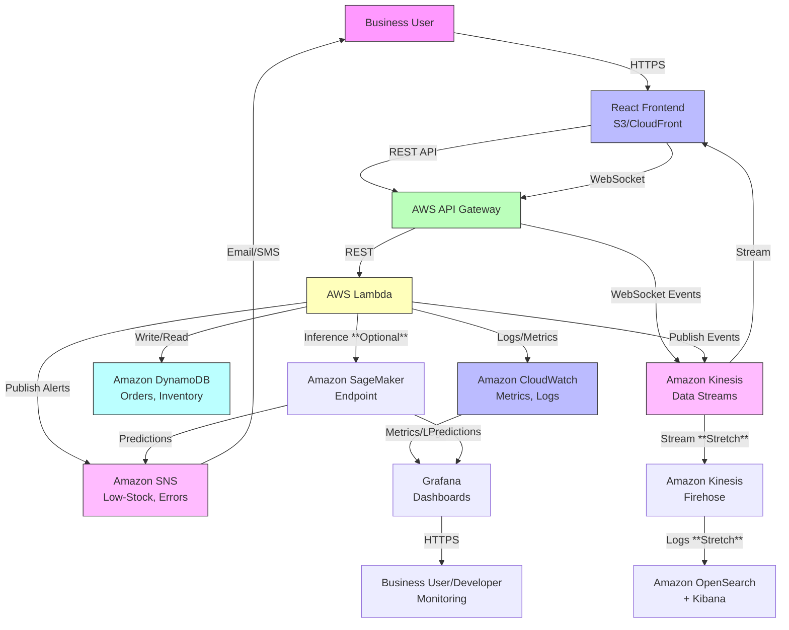

```mermaid
graph TD
    A[Business User] -->|HTTPS| B[React Frontend<br>S3/CloudFront]
    B -->|REST API| C[AWS API Gateway]
    B -->|WebSocket| C
    C -->|REST| D[AWS Lambda]
    C -->|WebSocket Events| E[Amazon Kinesis<br>Data Streams]
    D -->|Write/Read| F[Amazon DynamoDB<br>Orders, Inventory]
    D -->|Publish Events| E
    D -->|Publish Alerts| G[Amazon SNS<br>Low-Stock, Errors]
    D -->|Logs/Metrics| H[Amazon CloudWatch<br>Metrics, Logs]
    E -->|Stream| B
    E -->|Stream **Stretch**| I[Amazon Kinesis<br>Firehose]
    I -->|Logs **Stretch**| J[Amazon OpenSearch<br>+ Kibana]
    H -->|Metrics/Logs| K[Grafana<br>Dashboards]
    G -->|Email/SMS| A
    K -->|HTTPS| L[Business User/Developer<br>Monitoring]
    D -->|Inference **Optional**| M[Amazon SageMaker<br>Endpoint]
    M -->|Predictions| K
    M -->|Predictions| G

    style A fill:#f9f,stroke:#333
    style B fill:#bbf,stroke:#333
    style C fill:#bfb,stroke:#333
    style D fill:#ffb,stroke:#333
    style E fill:#fbf,stroke:#333
    style F fill:#bff,stroke:#333
    style G fill:#fbf,stroke:#333
    style H fill:#bbf,stroke:#333
```